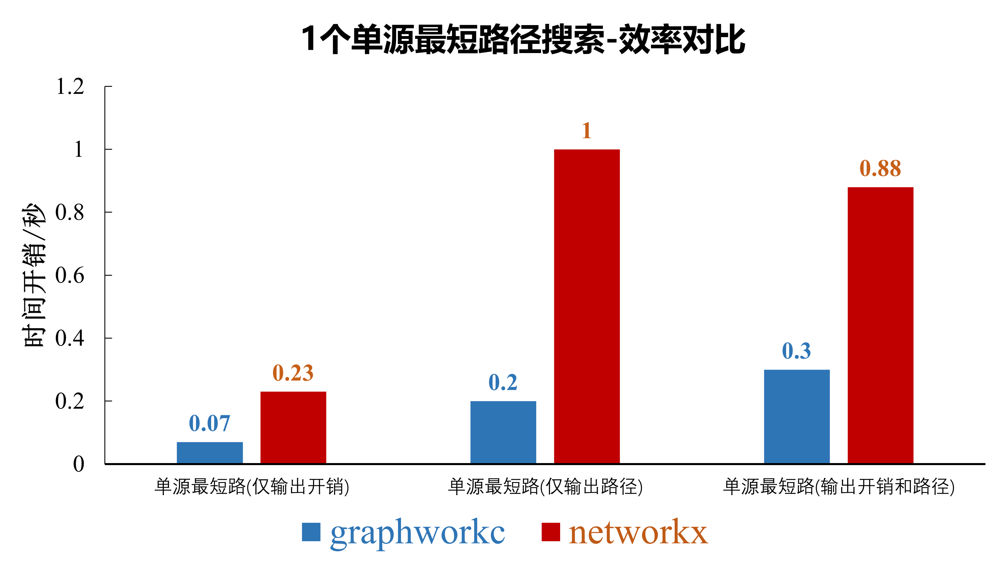
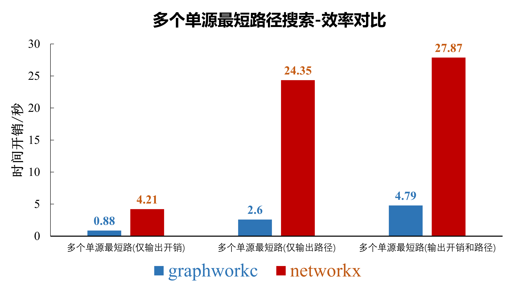

[杭州浙诚数据科技有限公司]: https://www.zhechengdata.com/

# GraphWorkC简介

<figure markdown="span" align="left">
  { width="300" }
</figure>


[](https://pepy.tech/project/graphworkc)


## 项目概述

GraphWorkC由[杭州浙诚数据科技有限公司]-数据分析团队开发， 是一个基于c++开发的高效图论分析工具，作为开源的python库，采用混合编程方式，对常用的图论算法进行了高效的实现。

graphworkc支持常用的最短路搜索算法(**持续更新**)，旨在提供一种高效的方式来处理和分析大规模图数据。

!!! note 
    
    这个项目正处在频繁的升级迭代期， 当前版本v1.1.9， 请用户及时更新.


**💬下一版本v1.2.0预计更新内容**

- 支持linux操作系统
- 单个OD起终点的路径搜索

## 性能对比

使用[networkx](https://github.com/networkx/networkx)v3.4.2版本与graphworkc在同一路网下进行最短路搜索测试，测试结果如下：


<figure markdown="span">
  
</figure>

<figure markdown="span">
  
</figure>

测试代码见[测试数据与代码](https://github.com/ZheChengData/graphworkc/tree/main/test)


## 如何使用

此开源库已上传至pypi官网，使用pip安装后即可使用，目前要求python版本>=3.9

### 如何安装
```
pip install graphworkc
```

### 如何更新
```
pip install --upgrade  graphworkc
```

### 用户反馈

- 如果您发现了graphworkc的BUG，请在[issue界面](https://github.com/ZheChengData/graphworkc/issues)提交
- 如果您有任何关于graphworkc的使用问题且在查阅[用户文档](https://zhechengdata.github.io/graphworkc/)后仍然无法解决，可以在[讨论区](https://github.com/ZheChengData/graphworkc/discussions)提问

欢迎加入**浙诚数据开源社群**获取更多咨询，由于目前两个微信群的人数均已超过200人，请您添加小助手后再入群：

<figure markdown="span">
  
</figure>

## graphworkc相关特性

- **开源**：项目完全开源，任何人都可以自由查看和贡献代码
- **跨平台**：支持多种操作系统，方便用户在不同环境下使用
- **高性能**：底层为c++驱动，不受python全局解释器锁GIL的限制
- **易于集成**：提供简单易用的 API 接口，便于与其他系统集成


## graphworkc主要功能

- **最短路径计算**：基于给定的 OD（Origin-Destination）对，计算并返回最短路径
- **最少花费计算**：考虑路网中的花费信息，计算从源点到目的点的最少花费路径
- **高效算法**：使用高效的图论算法，确保即使在大规模路网数据下也能快速计算结果
- **灵活的配置**：支持用户根据实际需求自定义路网结构和计算模型，便于适应各种应用场景

## graphworkc使用场景

- **交通运输**：适用于城市交通管理、道路规划等领域，帮助计算最优的行驶路线，优化交通流量
- **网络优化**：可以用于计算信息传输的最短路径或最低成本路径，提升网络效率
- **智能物流**：为物流公司提供路径优化方案，降低运输成本和时间

