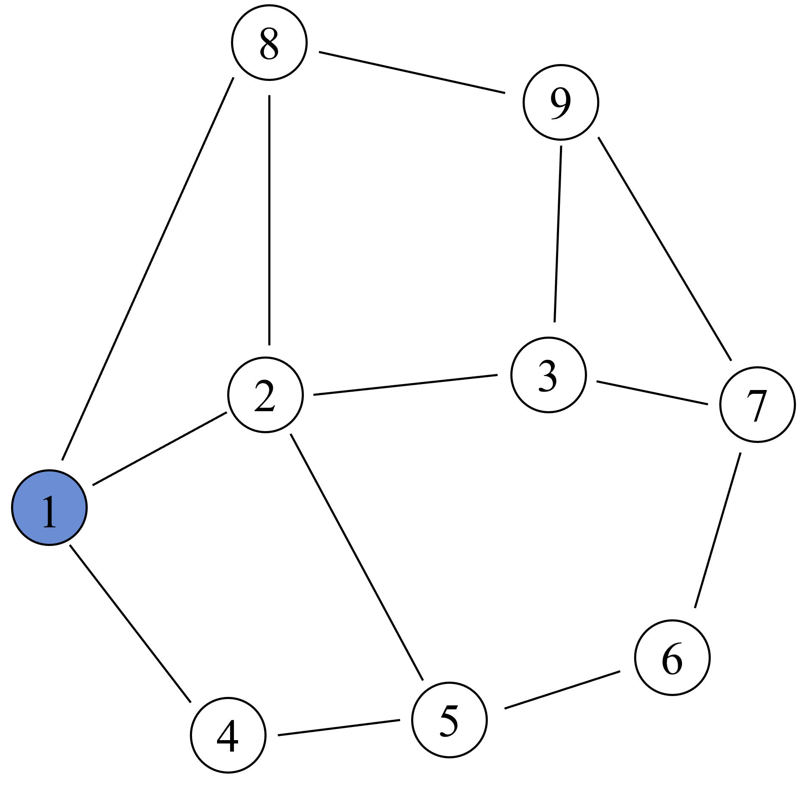
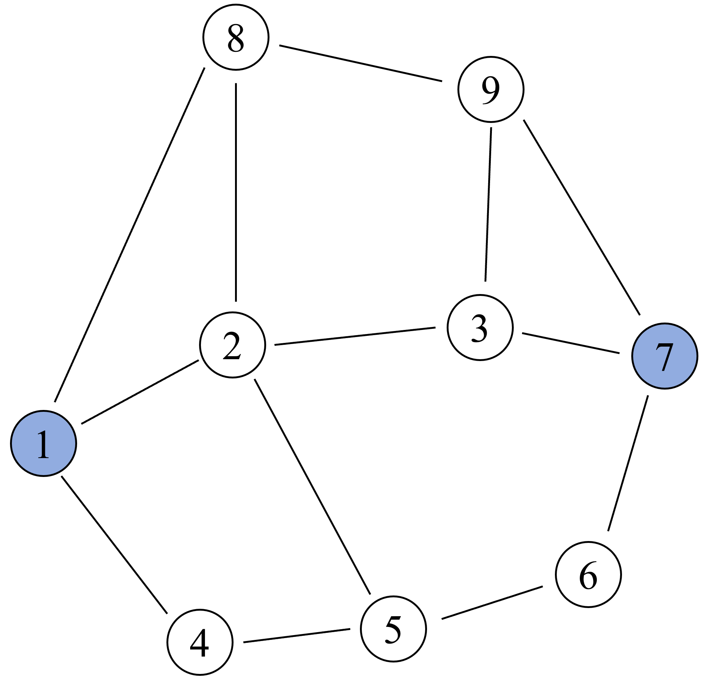
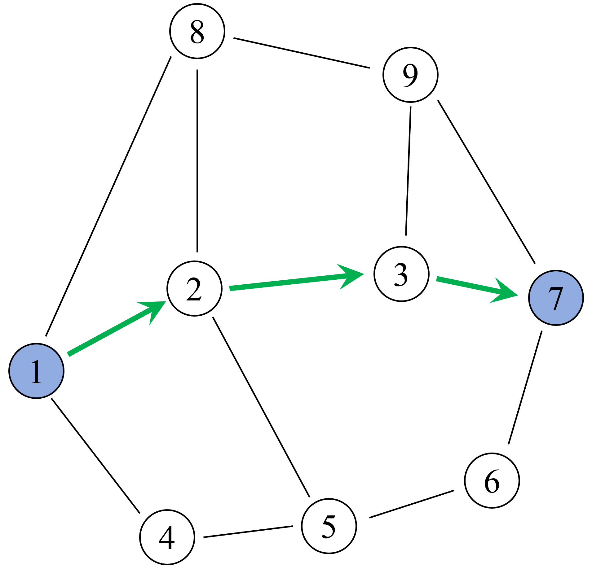
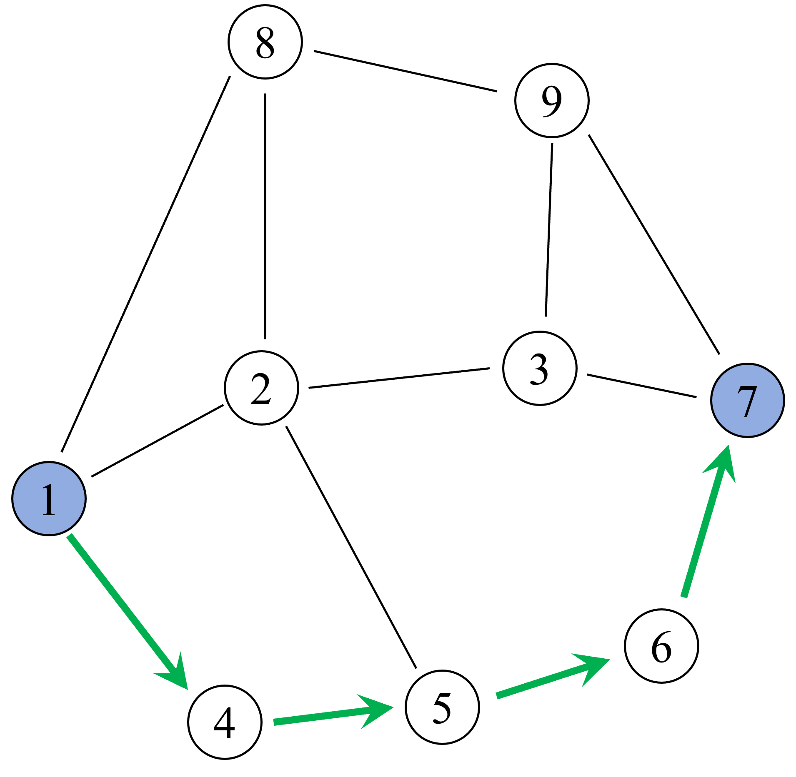
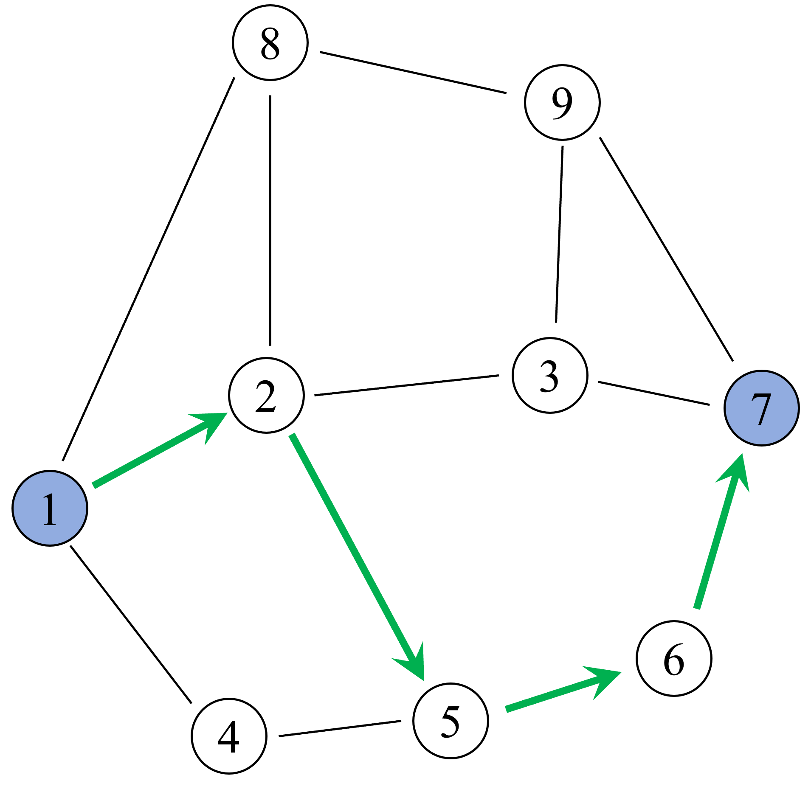

# 快速开始

此文档将帮助您开始使用graphworkc

[add_edge]: Fun&API/CGraphBase.md#add_edge
[add_edges]: Fun&API/CGraphBase.md#add_edges
[remove_edge]: Fun&API/CGraphBase.md#remove_edge
[remove_edges]: Fun&API/CGraphBase.md#remove_edges
[get_graph_info]: Fun&API/CGraphBase.md#get_graph_info
[get_node_info]: Fun&API/CGraphBase.md#get_node_info
[get_link_info]: Fun&API/CGraphBase.md#get_link_info
[set_centroid]: Fun&API/CGraphBase.md#set_centroid
[set_centroids]: Fun&API/CGraphBase.md#set_centroids
[multi_source_cost]: Fun&API/GraphAlgorithms.md#multi_source_cost
[multi_source_path]: Fun&API/GraphAlgorithms.md#multi_source_path
[multi_source_all]: Fun&API/GraphAlgorithms.md#multi_source_all
[single_source_cost]: Fun&API/GraphAlgorithms.md#single_source_cost
[single_source_path]: Fun&API/GraphAlgorithms.md#single_source_path
[single_source_all]: Fun&API/GraphAlgorithms.md#single_source_all
[multi_single_source_cost]: Fun&API/GraphAlgorithms.md#multi_single_source_cost
[multi_single_source_path]: Fun&API/GraphAlgorithms.md#multi_single_source_path
[multi_single_source_all]: Fun&API/GraphAlgorithms.md#multi_single_source_all
[cost_matrix]: Fun&API/GraphAlgorithms.md#cost_matrix
[path_dict]: Fun&API/GraphAlgorithms.md#path_dict
[path_dict_pairwise]: Fun&API/GraphAlgorithms.md#path_dict_pairwise
[k_shortest_paths]: Fun&API/GraphAlgorithms.md#k_shortest_paths
[shortest_path_cost]: Fun&API/GraphAlgorithms.md#shortest_path_cost
[shortest_path_path]: Fun&API/GraphAlgorithms.md#shortest_path_path
[shortest_path_all]: Fun&API/GraphAlgorithms.md#shortest_path_all


## 创建一个图

创建一个没有节点和边的空图：

```python
import graphworkc as gw
g = gw.CGraph()
```

## 添加边

[add_edge]函数用于添加有向边。例如：添加从节点1指向节点2的有向边`(1, 2)`，同时支持指定该有向边的属性值

```python
for i in range(100):
    # 向图g中添加有向边(i, i + 1)，同时指定两个属性值：weight和length
    g.add_edge(i, i + 1, {"weight": 2, "length":3})
```

[add_edges]函数可以一次性添加多条有向边：


```python
g.add_edges([(200, 201, {"weight": 2}),
             (201, 202, {"weight": 2}),
             (202, 203, {"weight": 2})])
```

## 删除边

[remove_edge]函数可以删除指定的有向边：

```python
g.remove_edge(1,2)
```

[remove_edges]函数可以一次性删除多条有向边:

```python
g.remove_edges([(3, 4),
                (4, 5),
                (5, 6)])
```

## 设置形心点

[set_centroid]函数可以将图中的一个节点设置为**形心点**；[set_centroids]函数可以一次性将多个点设置为形心点。

```python
g.set_centroid(1)
g.set_centroids([2, 3, 4])
```

## 获取基本信息

- [get_graph_info]：用于获取图的基本信息
- [get_node_info]：用于获取点的基本信息
- [get_link_info]：用于获取边的基本信息

```python
info_g = g.get_graph_info()
print(info_g)

info_n = g.get_node_info(1)
print(info_n)

info_l = g.get_link_info(1, 2)
print(info_l)
```

在下面的最短路算法接口演示中，均采用下图的graph为样例：

<figure markdown="span">
  { width="250" }
  <figcaption>edge_list所构造的示例graph</figcaption>
</figure>

```python
import graphworkc as gw
g = gw.CGraph()
edge_list = [(1, 2, {'l': 1.23}), (2, 1, {'l': 1.23}), 
             (8, 1, {'l': 3.13}), (1, 8, {'l': 3.13}), 
             (4, 1, {'l': 1.66}), (1, 4, {'l': 1.66}),
             (8, 2, {'l': 2.77}), (2, 8, {'l': 2.77}),
             (2, 5, {'l': 2.79}), (5, 2, {'l': 2.79}),
             (2, 3, {'l': 2.01}), (3, 2, {'l': 2.01}),
             (8, 9, {'l': 2.66}), (9, 8, {'l': 2.66}),
             (3, 9, {'l': 2.56}), (9, 3, {'l': 2.56}),
             (7, 9, {'l': 2.79}), (9, 7, {'l': 2.79}), 
             (7, 3, {'l': 0.99}), (3, 7, {'l': 0.99}),
             (7, 6, {'l': 1.29}), (6, 7, {'l': 1.29}),
             (5, 6, {'l': 0.89}), (6, 5, {'l': 0.89}),
             (4, 5, {'l': 0.79}), (5, 4, {'l': 0.79})]
g.add_edges(edge_list)
```


## 单源最短路计算

<figure markdown="span">
  { width="250" }
  <figcaption>示例：以1为单源起点</figcaption>
</figure>


### 单源最短路-仅返回开销
[single_source_cost]函数可以获取单源节点到各个节点的最短路花费：

```python
s_cost = g.single_source_cost(1, weight_name="l")
print(s_cost)
# {9: 5.79, 1: 0.0, 2: 1.23, 8: 3.13, 4: 1.66, 5: 2.45, 3: 3.2399999999999998, 6: 3.3400000000000003, 7: 4.2299999999999995}
```

### 单源最短路-仅返回路径
[single_source_path]函数可以获取单源节点到各个节点的最短路路径：

```python
s_path = g.single_source_path(1, weight_name="l")
print(s_path)
# {9: [1, 8, 9], 1: [1], 2: [1, 2], 8: [1, 8], 4: [1, 4], 5: [1, 4, 5], 3: [1, 2, 3], 6: [1, 4, 5, 6], 7: [1, 2, 3, 7],}

```

### 单源最短路-返回路径和开销
[single_source_all]函数可以获取单源节点到各个节点的最短路径和花费：

```python
s_all = g.single_source_all(1, weight_name="l")
print(s_all.paths)
print(s_all.cost)
```

## 多个单源最短路计算

该些函数帮助您一次性完成多个单源最短路的计算：

- [multi_single_source_cost]：用于计算多个单源最短路(仅返回开销)
- [multi_single_source_path]：用于计算多个单源最短路(仅返回路径)
- [multi_single_source_all]：用于计算多个单源最短路(返回路径开销)

```python
ms_cost = g.multi_single_source_path([1, 7], weight_name="l")
print(ms_cost[0]) # {9: [1, 8, 9], 1: [1], 2: [1, 2], 8: [1, 8], 4: [1, 4], 5: [1, 4, 5], 3: [1, 2, 3], 6: [1, 4, 5, 6], 7: [1, 2, 3, 7],}
print(ms_cost[1]) # {7: [7], 1: [7, 3, 2, 1], 9: [7, 9], 3: [7, 3], 6: [7, 6], 2: [7, 3, 2], 5: [7, 6, 5], 4: [7, 6, 5, 4], 8: [7, 9, 8],}
```

## 多源最短路计算

<figure markdown="span">
  { width="250" }
  <figcaption>示例：以1、7为多源起点</figcaption>
</figure>

### 多源最短路-仅返回开销

[multi_source_path]函数可以获取多源节点到各个节点的最短路径开销：

```python
# 不限制搜索截断
m_path = g.multi_source_path([1, 7], weight_name="l")
print(m_path)
# {9: 2.79, 1: 0.0, 7: 0.0, 2: 1.23, 8: 3.13, 4: 1.66, 3: 0.99, 6: 1.29, 5: 2.18}
```


```python
# 限制搜索截断为2.5
m_path = g.multi_source_path([1, 7], cut_off=2.50, weight_name="l")
print(m_path)
# {1: 0.0, 7: 0.0, 2: 1.23 4: 1.66, 3: 0.99, 6: 1.29, 5: 2.18}
```

### 多源最短路-仅返回路径
[multi_source_cost]函数可以获取多源节点到各个节点的最短路花费

```python

m_path = g.multi_source_path([1, 7], weight_name="l")
print(m_path)
# {9: [7, 9], 1: [1], 7: [7], 2: [1, 2], 8: [1, 8], 4: [1, 4], 3: [7, 3], 6: [7, 6], 5: [7, 6, 5]}
```

### 多源最短路-返回路径和开销

[multi_source_all]函数可以获取多源节点到各个节点的最短路路径和花费：

```python
m_all = g.multi_source_all([1, 7], weight_name="l")
print(m_all.cost)
print(m_all.paths)
```

## 多OD-最短路花费矩阵生成

[cost_matrix]函数根据输入的起点列表和终点列表，计算生成获得一个开销矩阵

|              | end_node_1 | end_node_2 | end_node_3 | ... | end_node_n |
|--------------|-----|-----|-----|-----|------------|
| **start_node_1** | v11 | v12 | v13 | ... | v1n        |
| **start_node_2** | v21 | v22 | v23 | ... | v2n        |
| **start_node_3** | v31 | v32 | v33 | ... | v3n        |
| ...          | ... | ... | ... | ... | ...        |
| **start_node_m** | vm1 | vm2 | vm3 | ... | vmn        |

该结果矩阵：

- 行索引顺序与`start_nodes_list`一致
- 列索引顺序与`end_nodes_list`一致

```python
start_nodes_list = [1, 4]
end_nodes_list = [3, 7]
s_matrix = g.cost_matrix(start_nodes_list, end_nodes_list,
                                  weight_name="l", num_thread=10)
print(s_matrix)
# [[3.24 4.23]
# [3.96 2.97]]
```

## 多OD-最短路路径字典生成（多对多生成）

[path_dict]函数根据输入的起点列表和终点列表，计算生成获得一个路径字典：

```python
start_nodes_list = [1, 4]
end_nodes_list = [3, 7]
s_list = g.path_list(start_nodes_list, end_nodes_list, 
                             weight_name="l", num_thread=10)
print(s_list)
# {(1, 3): [1, 2, 3], (1, 7): [1, 2, 3, 7], (4, 3): [4, 5, 6, 7, 3], (4, 7): [4, 5, 6, 7]}
```

## 多OD-最短路路径字典生成（一对一生成）：

[path_dict_pairwise]函数根据输入的起点列表和终点列表，计算生成获得一个一一对应的路径字典(起点列表的第i个序列和终点列表的第i个序列生成一个OD对)：

```python
start_nodes_list = [1, 4]
end_nodes_list = [3, 7]
s_list = g.path_dict_pairwise(start_nodes_list, end_nodes_list, 
                             weight_name="l", num_thread=10)
print(s_list)
# {(1, 3): [1, 2, 3], (4, 7): [4, 5, 6, 7]}
```

## 寻找K条最短路

[k_shortest_paths]函数根据输入的**起点**和**终点**，返回两点之间**最短的前K条路径**：

假设有如下图：则可通过此函数获取**节点1到节点7**的最短的三条路径

=== "最短"

    <figure markdown="span">
      { width="400" }
    </figure>

=== "第二短"

    <figure markdown="span">
      { width="400" }
    </figure>

=== "第三短"

    <figure markdown="span">
      { width="400" }
    </figure>


```python
res = g.k_shortest_paths(1, 7, 3, weight_name="l")
print(res)
# [[1, 2, 3, 7], [1, 4, 5, 6, 7], [1, 2, 5, 6, 7]]
```

## 单OD-最短路路径计算

<figure markdown="span">
  { width="250" }
  <figcaption>示例：以1为起点，7为终点</figcaption>
</figure>


### 仅返回开销

[shortest_path_cost]函数根据输入的**起点**和**终点**，返回两点之间**最短路径的开销**：

```python
res = g.shortest_path_cost(1, 7, weight_name="l")
print(res)
# 4.23
```

### 仅返回路径

[shortest_path_path]函数根据输入的**起点**和**终点**，返回两点之间**最短路径的路径**：

```python
res = g.shortest_path_path(1, 7, weight_name="l")
print(res)
# [1, 2, 3, 7]
```

### 返回开销和路径

[shortest_path_all]函数根据输入的**起点**和**终点**，返回两点之间**最短路径的开销和路径**：

```python
res = g.shortest_path_all(1, 7, weight_name="l")
print(res)
# (4.23, [1, 2, 3, 7])
```

